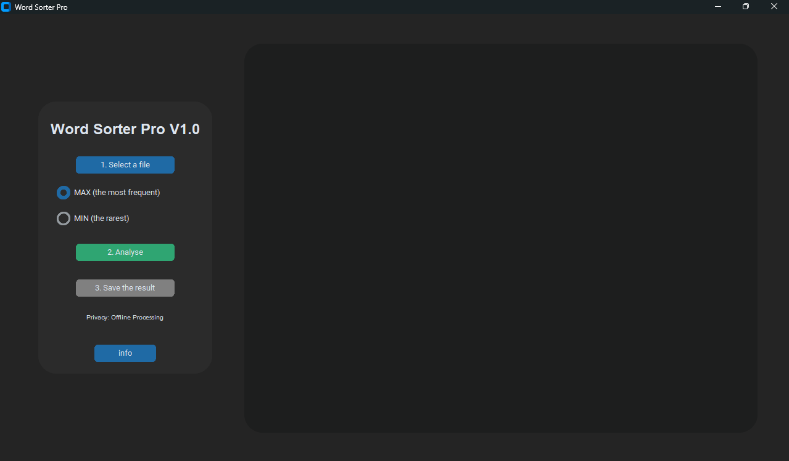

# Word Sorter Pro v1.0

**Professional text analysis tool for Windows.**

High-performance desktop application for word frequency analysis, keyword extraction, and linguistic research. 

---

### 📄 Core Features
*   **Privacy First:** 100% offline processing. No data leaves your PC.
*   **Formats:** Supports `.docx` and `.txt` files.
*   **Modes:** 
    *   **MAX:** Frequency analysis for SEO.
    *   **MIN:** Detection of rare terminology.
*   **Portable:** No installation required.

---

### 📸 Interface

---

### 📬 Contact
For licensing and inquiries:  
**wordsorter@proton.me**

---
*© 2026 Aleksandr Protopopov*
